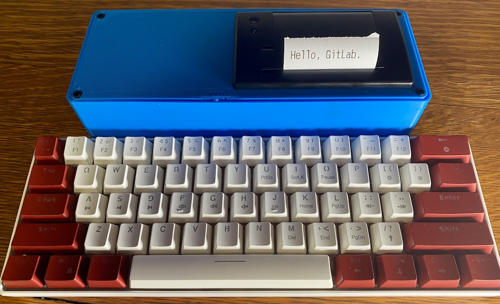
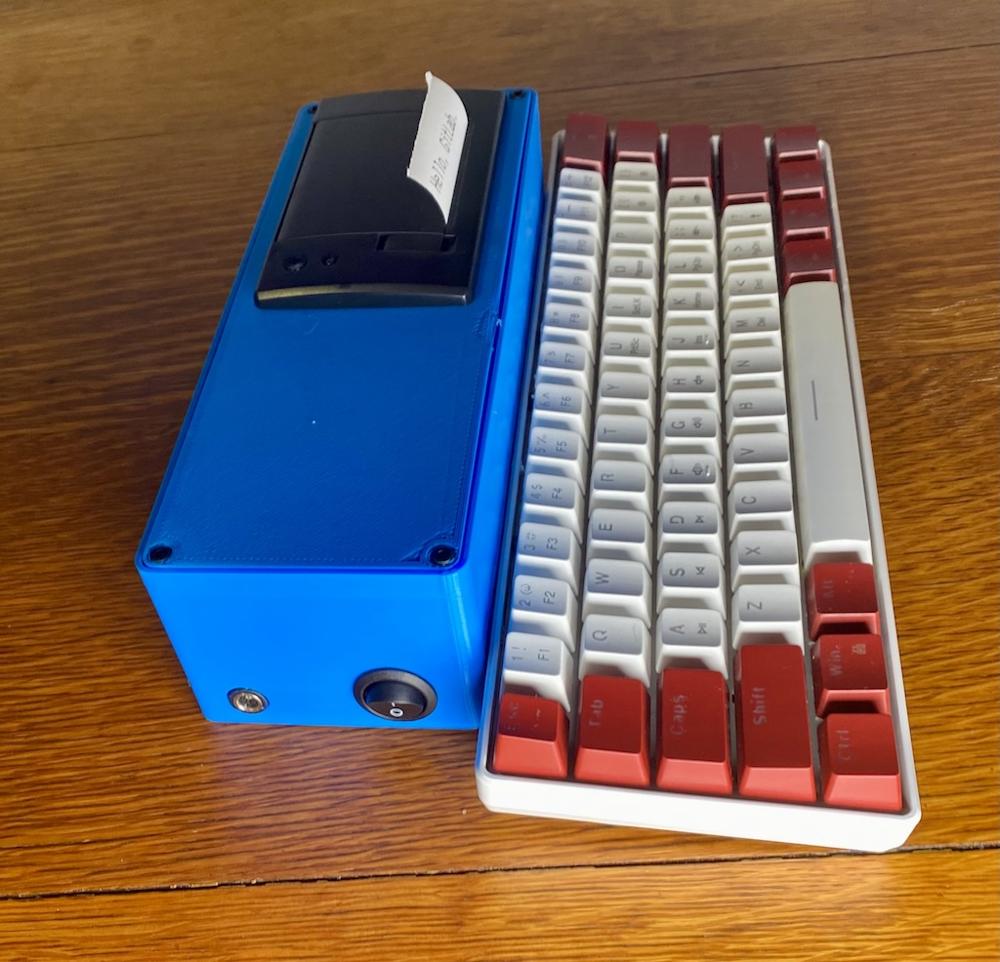

# AftonTyper

[](https://www.youtube.com/watch?v=ykdp6Gb4HfA)
Top view


Side view, showing power switch

## What

For `$reasons`, my (2.5yo) son currently hears and understands spoken language excellently, but speaks only a few words. He speaks increasingly fluent [ASL](https://en.wikipedia.org/wiki/American_Sign_Language). (Yes, he *does* see a ton of experts! They're currently shrugging and waving vaguely at [my son's explosive entry into the world](https://vimeo.com/772624589/0292a5e728) when saying "uh... we don't know why he's doing this, but he sure is a singular child.") 

Long story long, he's now learning to read English before learning to speak English, and he loves to come type on my keyboard. I gave him his own keyboard, but he doesn't like that nothing _happens_ when he types on a keyboard disconnected from everything. So I decided to build him a screenless typing device where he gets output when he provides input.

If he uses this to teach himself to _write_ before he speaks English, well, that'll just be a whole new thing for all the experts to consider. I think they'll [have kittens](https://dictionary.cambridge.org/us/dictionary/english/have-kittens)!


## Components

* Microcontroller: [Adafruit Feather RP2040 with USB Host](https://www.adafruit.com/product/5723). It doesn't need much in the way of brains, but it *does* need a USB host stack. I was worried I'd end up with an ESP32 or something else with overkill performance (and power draw) for this use, but Adafruit has made several "Feather" boards that can take an [add-on USB host board](https://www.adafruit.com/product/5858), but just as I was going to buy it, I came across this all-in-one board. As [the tutorial](https://learn.adafruit.com/adafruit-feather-rp2040-with-usb-type-a-host) notes, "this is definitely a firmware hack: you will need to dedicate the second ARM core and both PIO peripherals to just handling the USB messages." So I probably couldn't run a giant LED matrix or anything, but I'm not.
* Thermal printer: [Adafruit Mini Thermal Receipt Printer](https://www.adafruit.com/product/597). I already had one around that wasn't being used, but if you don't, since Adafruit doesn't stock it anymore, AliExpress has identical ones; search for "mini serial thermal printer" and then look at the photos (in particular, of the wiring/bottom). It runs on anything from 5v-9v.
* Battery: [Bioenno 6v LFP](https://www.bioennopower.com/products/6v-3ah-lfp-battery-charger). I needed something to provide 5v-9v to the printer that I could also use to provide power to the Feather. The feather has an onboard LiPo charger, but only for 3.7v, and they specifically do not recommend powering it via pins or anything *other* than the LiPo port or the USB port. So I decided on the USB with the next device.
* Voltage Converter (for microcontroller): [Adafruit Verter](https://www.adafruit.com/product/2190). Perfect for this because it can supply a steady 5v across the entire range of a 6v (nominal) LFP battery. Could there be a more elegant solution? Sure, but this does what it says on the tin and I'm not trying to source giant amps out of it, so it works wonderfully and reliably.
* Power switch: I thought I had a rocker power switch in a junk drawer, but couldn't find it. I used [this one from Amazon](https://www.amazon.com/dp/B07S1MV462) but use whatever you have laying around; all that matters is that you know the size of hole it wants to sit in. (In this case, 20mm.)
* Keyboard: I wanted USB (so it doesn't have a separate battery to charge), a 60% layout (so it's relatively small to carry around), mechanical (so it feels cool), and relatively inexpensive. I actually didn't want an LED backlight, but I _could not find a 60% keyboard that didn't have backlights_ so whatever. I settled on [this one from Amazon](https://www.amazon.com/gp/product/B0BZTW2S9P/) but anything will do.
* 3D printed: [zx82net Parametric Project Box](https://www.printables.com/model/60749-universal-parametric-project-box). I opened it in [Fusion 360](https://www.autodesk.com/products/fusion-360/personal), adjusted its parameters to what I needed, then cut the extra holes I needed (for power input, power switch, printer, and screws) and printed it on my [Creality Ender 5 Pro](https://www.creality.com/products/ender-5-pro-3d-printer). It's not a great 3D printer, but 1) I got it years ago and it still works, and 2) the point is you don't *need* an incredible thermal printer to do this. I printed it in PLA because that's all I ever use.
* Screws: I used short M2.5 machine screws, washers, and nuts to attach the 3D printed box to the keyboard (I just popped the number keys off the keyboard and then drilled attachment holes). The holes in the 3D-printed box could have been smaller, but then the alignment would have been tighter; this works sufficiently for my needs. (You definitely don't want to glue it, because toddler toy; it's entirely possible I'll need to print another box in a few months depending on how hard it gets dropped.) The screw holes are positioned with the intent that the keyboard and box share the same bottom plane, just to avoid balance issues.

The Bioenno battery comes with its power output terminals crimped in [Anderson Powerpole](), but if that's not a format you like, just pop the contacts out of the plug, cut, and do something else that makes you happier.

## How to Run

You need the Arduino environment, and then you need to add a bunch of board types and libraries to it. The header of [Arduino/aftontyper/aftontyper.ino](Arduino/aftontyper/aftontyper.ino) has all the details to the level of "click here, then there." You'll need to make sure that [Arduino/aftontyper/usbh_helper.h](Arduino/aftontyper/usbh_helper.h) is in the same folder as the `.ino`.

Compile, upload to board, plug it in. You can run the board and keyboard just fine from standard USB power and don't need to use the Verter module for testing (other than testing the power supply). The thermal printer you can run direct from the battery (which is what I do in production) or from a 6v-9v bench power supply; note that when printing wide dark lines, **it peaks over 2A of instantaneous current** (around 2.2A I think), so make sure your supply can handle that.

### Wiring Diagram

It's pretty self-explanatory, but here's what I did.
Note that the RP2040 pins are just set in code; they're not special pins of any kind. Change them with the appropriate lines in the `.ino` file.

```
  ┌─────────────────┐
  │ Thermal Printer │  ┌──────────────────────┐
  │ Comms       Pow │  │       ┌────────────┐ │
  ├─────┐     ┌─────┤  │       │ 6v Battery │ │
  │T R G│     │ + - │  │       │ +       -  │ │
  └┬─┬─┬┴─────┴─┬─┬─┘  │       └─┬───────┬──┘ │
   │ │ │        │ └────┘  ┌──────┴─┐     ├────┘
   │ │ │        └───────┬─┤ Switch │     │
   │ │ │                │ └────────┘     │
   │ │ └──────────┐     │                │┌────────────┬─┐
   │ └───────┐    │     │                └┤-           │U│
   └────┐    │    │     │                 │   Verter   │S├─┐
        │    │    │     └─────────────────┤+           │B│ │
  ┌───┬─┴────┴────┴─┬────┐                └────────────┴─┘ │
  │ U │ 24   25   G │  H │                                 │
┌─┤ S │             │U o │   ┌──────────┐                  │
│ │ B │   RP 2040   │S s ├───┤ Keyboard │                  │
│ │ C │   Feather   │B t │   └──────────┘                  │
│ └───┴─────────────┴────┘                                 │
└──────────────────────────────────────────────────────────┘
```

(Thanks, [ASCIIflow](https://asciiflow.com/)!)

## Features

* "Debouncing" to prevent hitting a capital and a lowercase of the same letter, every time, due to how it processes incoming keys. (That's what `comparator` is doing in the code.)
* Multiple spacebar invocations are combined to one, and it trims spaces off the ends of lines when excreting lines.
* Automatically spits out a line to the printer when the buffer gets full (length set in `buffer_length`). If you change the font size or typeface, you'll probably want to adjust this so that the lines are "full" looking.

Other than that, very little. This is mostly a proof of how little it takes since Adafruit did all the hard work (both in making the microcontroller, and then in making the demo code), and I am very grateful to them. :-) Buy their stuff!

## License

MIT because ~70% of the code is Adafruit's MIT'd example code that I cut down, and I don't want to cause license incompatibilities.

## Where?

"Wait, don't you work for GitLab? Why is this here?" You're right; I wanted to put it on GitLab, but I [couldn't get a formal confirmation](https://gitlab.com/gitlab-com/content-sites/handbook/-/merge_requests/10700) that the (standard) IP assignment that GitLab uses wouldn't eat personal IP like this. So it's here!
